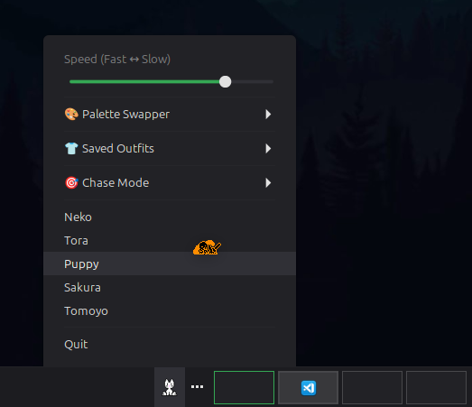
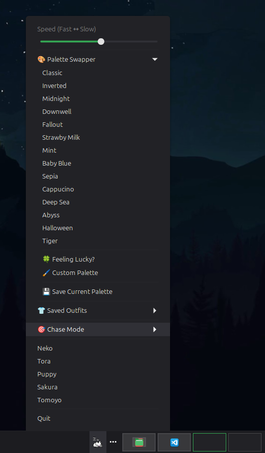
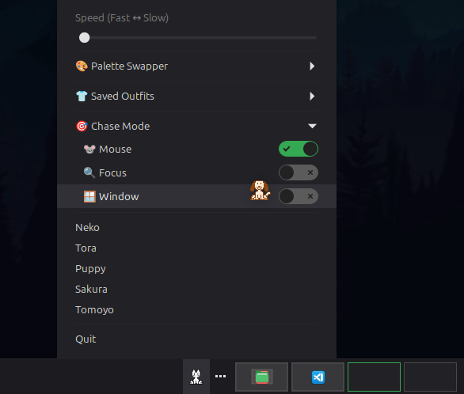

# Oneko Plus
A Cinnamon Panel Applet that unlocks the full potential of the classic "oneko" command's features in a simple and elegant graphical user interface.

## Disclaimer
This applet exists because I was unhappy with the extremely limited functionality present in the offical Cinnamon Spice onekoToggle. Maintenance of the applet is best-effort as this is mainly a personal project. I have published it here simply for those like me who desperately wanted more out of onekoToggle. This applet was created with the help of artificial intelligence.





## Compatibility
- Cinnamon (X11 session) ✓
- Cinnamon on Wayland ❌
- Other Desktop Environment ❌ 

oneko and xsetroot are X11 only. See Dependencies below.

This applet was developed and tested on Cinnamon 6.6.7 running on an X11 session.

## Features
### Current Features
1. Sprite Selection (Neko, Tora, Dog, Sakura, Tomoyo)
2. Palette Selection (Preset, Custom, and Random)
3. Outfit Selection (Custom Sprite + Palette Combos)
4. Chase Mode (Cursor, Focus, Window)
5. Speed Slider
6. Middle-Click "Quick Launch" Mode that remembers your last used settings
6. Persistent Settings, Saved Palettes and Outfits
7. Configuration Menu to enable/disable Sakura and Tomoyo as well as changing SubMenu titles.

In the menu I call oneko -dog "Puppy." This is a way better name and unfortunately you'll have to deal. Or you can change it. I'm not a cop.

### Features in Progress
1. Enabling the -position flag to control sprite position relative to cursor
2. Enabling the -display flag to change the monitor oneko is displayed on
3. Fixing/smoothing over minor quirks

## Dependencies
Debian/Ubuntu/Mint:
```bash
sudo apt install oneko zenity x11-apps
```

Fedora:
```bash
sudo dnf install oneko zenity xorg-x11-apps
```

Arch:
```bash
sudo pacman -S oneko zenity xorg-xsetroot
```
- The specific oneko version is 1.2.sakura.5 (Check your version with "oneko -patchlevel")
- Zenity is for dialog boxes
- Relies on xsetroot

## Installation Instructions
1. Download the parent directory (onekoPlus@robinjay) !!DO NOT RENAME!!
2. Move entire folder into ~/.local/share/cinnamon/applets
3. Open the Cinnamon Applet Manager ("Applets")
4. Enable Oneko Plus in the "Manage" tab (NOT "Download")

If onekoPlus does not appear in the Applet Manager try restarting Cinnamon with ALT + F2, r, ENTER

## Limitations
1. This applet is simply a graphical frontend for the classic oneko command for the Cinnamon Desktop Environment. Any features not present in the original oneko script cannot be implemented into this applet (e.g. changing sprite size). 
2. The 'Chase Window Mode' (oneko -towindow) has a slight quirk where you need to re-activate oneko and then select the window. A pop-up dialog further elaborates on how to do this when you select 'Chase Window Mode.' This is built into oneko and I tried to make it as seamless as possible. 
3. Sometimes a cursor sprite will stick around in unwanted places, this is also a quirk of oneko. I minimized it as much as possible but will still crop up occasionally. If a cursor sprite is being really stubborn try dragging a window, restarting oneko, or restarting the applet itself/Cinnamon.
4. The menu can get a bit tall with multiple submenus open and custom palettes saved. This is because Cinnamon opens submenus vertically. Feel free to edit the applet.js to remove some of the preset palettes to free up some space if you wish, they're pretty easy to spot in the applet.js and are easily commented out/removed entirely. 
